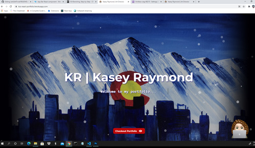

# Kasey's React Portfolio

## Description:

Portfolio designed using React JS library. Includes school projects and also some professional projects that I have worked on. Links to Github and Linkedin are also included in the contact me section. Had some fun with it including react-particles-js for some animation.

---

> ## Table of Contents

- [Installation](#installation)
- [Usage](#usage)
- [Contributing](#contributing)
- [Tests](#tests)
- [Questions](#questions)

## Installation:

To install necessary dependencies run the following command:

> npm i

## Usage Information:

React app is delpoyed to Heroku and all functionality is demoed in the browser. Click the screenshot to redirect to deployed app. To run locally you need to install all dependencies.

> 

## Contributing Information:

Nothing at this time this is a personal portfolio.

## Tests:

To run tests, run the following command:

> n/a

## Questions:

---

> Creator Github account: [Kasey Raymond](https://api.github.com/users/KcRaymond)

> Email Creator: [kaseyleigh1978@gmail.com](mailto:)
